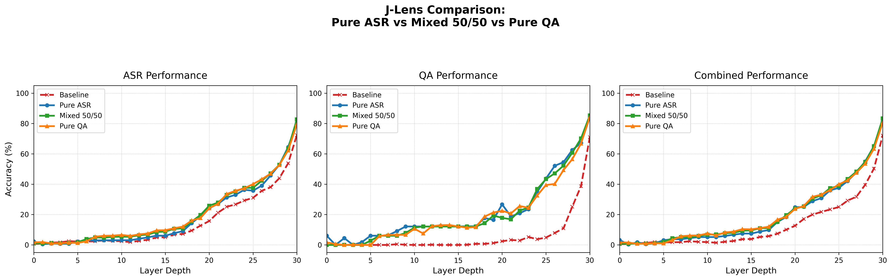

# J-Lens on Qwen2-Audio (12GB VRAM Optimization)

模型：Qwen2-Audio-7B-Instruct
---
## 這個專案在做什麼（from claude)

**J-Lens（Jacobian Lens）** 是 Anthropic 提出的一種模型內部可解釋性技術。語言模型每一層的殘差流（residual stream）活在不同的「基底空間」裡，如果直接把中間層的激發值丟進最後的 unembed（也就是傳統的 *logit lens*），讀出來的東西大多是雜訊，因為中間層根本沒有活在跟輸出層一樣的座標系裡。

J-Lens 的做法：對每一層 fit 出一個線性轉換矩陣 `J_l = E[∂h_final/∂h_l]`（該層激發值對最終輸出的平均一階效應），再用它把中間層的激發值「轉正」到輸出層的座標系，才做 unembed 讀出。理論上能比傳統 logit lens 更早、更準地讀出模型「心裡在想什麼」。

這個專案做的事：把這套原本針對純文字 LLM 設計的技術，**搬到一個語音輸入、文字輸出的多模態模型（LALM）上**，並且全程限制在一張消費級 12GB 顯卡上完成。

參考實作：[anthropics/jacobian-lens](https://github.com/anthropics/jacobian-lens)（Apache-2.0）

---
## 硬體限制與壓縮技術權衡

為了在 12GB 顯存下塞得下一個 7B 模型 + Jacobian 擬合所需的反向傳播，本專案採用：

- **4-bit (NF4) 量化**：模型權重約壓到 5.9GB，留下空間給擬合階段的計算圖
- **梯度凍結 + `start_graph_at` 機制**：讓 J-Lens 官方函式庫的計算圖只從你要探測的那一層開始建，不用整條網路都保留梯度
- **音訊特徵快取**：Whisper 音訊編碼器的前向計算只跑一次（`no_grad`），快取結果重複使用，避免每次反向傳播的 batch 複製都要重跑一次音訊編碼器（這是 12GB 顯卡上最容易爆記憶體的地方）

代價：
- 4-bit 壓縮會讓模型的數值精度打折，J-Lens 學到的特徵映射是基於「量化過的」模型內部狀態，不是原始 bf16/fp16 精度下的狀態
- 反向傳播需要即時反量化權重，運算比全精度慢
- 受限於時間預算，fit 語料規模控制在 100 筆量級（官方文件建議這個量級足以 fit 出「堪用」的 lens，但跟論文裡用大規模算力 fit 出的版本相比，雜訊會明顯更多）

---
## 環境

| 項目 | 版本 |
|---|---|
| OS | Ubuntu 22.04 LTS |
| GPU | NVIDIA GeForce RTX 3060 (12GB / 實測可用 ~11.6GB) |
| NVIDIA 驅動 | ≥ 550.x |
| CUDA | 12.1 |
| Python | 3.10 (conda/venv 隔離環境) |
| PyTorch | 2.5.1+cu121 |
| transformers | 5.16.0.dev0（從 source 安裝：`pip install git+https://github.com/huggingface/transformers`，Qwen2-Audio 在較新版本才穩定支援）|
| bitsandbytes | 0.50.1（4-bit NF4 量化）|
| accelerate | 1.14.0 |
| librosa | 0.11.0 |
| soundfile | 0.14.0 |
| jacobian-lens | Apache-2.0，來自 `anthropics/jacobian-lens`，`pip install -e .` 本地安裝 |

---
## 實驗設計

| 實驗 | 訓練語料 | 目的 |
|---|---|---|
| **A：ASR** | 100 筆 FLEURS 短語音（50筆英文 `en_us` + 50筆中文 `cmn_hans_cn`，2-5 秒）| 純語音轉寫任務下，J-Lens 能否比傳統 logit lens 更早讀出正確概念 |
| **C：QA** | 100 筆 ESC-50 環境音問答（5 秒動物/環境音，「請描述這段音訊裡的聲音是什麼」）| 驗證 J-Lens 在非語言類音訊理解任務上的表現 |
| **B：50/50 混合** | 從 A、C 各抽 50 筆混合 | 測試「窄語料分開 fit」vs「多樣語料合併 fit」哪個更好，同時檢驗合併 fit 是否會發生災難性遺忘 |

擬合細節：`dim_batch=4`、全部 32 層一起 fit（`source_layers=0..30`，`target_layer=31`）、每筆 prompt 用「音訊 prompt + ground-truth 逐字稿」teacher-forcing 組成完整輸入序列。
驗證集（`jlens_val_dataset`）與三個訓練集完全隔離、無重疊。

---


## 目前的發現

### 1. Phase 5 健檢（in-sample，僅供除錯參考，不是正式結果）

用實驗 A 的 lens，在 2 筆訓練語料本身（EN_0、ZH_0）上做的健檢：

| 樣本 | J-Lens (layer 30) | 傳統 logit lens (layer 30) |
|---|---|---|
| EN_0 | 58.6% | 55.9% |
| ZH_0 | 50.0% | 41.8% |

質化上還觀察到「eBay」這個詞在 layer 4 就被 J-Lens 讀出，比傳統 logit lens（要到 layer 16 才有意義）早了 12 層。**這是個真實但挑出來的個案**，不能代表整體趨勢——正式的量化結論看下面 Phase 6。

### 2. Phase 6 正式驗證（嚴格 held-out，三個 lens 完整對比）



| Layer | ASR 驗證集<br>Pure ASR / Mixed / Pure QA / Baseline | QA 驗證集<br>Pure ASR(zero-shot) / Mixed / Pure QA / Baseline |
|---|---|---|
| 0 | 2.3% / 1.1% / 1.7% / 0.7% | 6.1% / 0.0% / 1.7% / 0.0% |
| 10 | 3.1% / 5.4% / 6.6% / 2.4% | 12.2% / 11.4% / 10.7% / 0.0% |
| 20 | 24.2% / 25.9% / 24.2% / 15.7% | 26.7% / 17.9% / 22.5% / 2.4% |
| 26 | 39.1% / 42.3% / 43.3% / 35.7% | 52.1% / 47.1% / 40.2% / 7.9% |
| 29 | 64.5% / 63.5% / 62.3% / 53.8% | 67.2% / 70.2% / 66.8% / 38.8% |
| 30 | 80.5% / 82.7% / 79.5% / 72.4% | 84.0% / 85.4% / 84.3% / 71.1% |

（n(ASR)=2740、n(QA)=823 個有效文字位置；ASR 欄對 Pure QA 是 zero-shot、QA 欄對 Pure ASR 是 zero-shot）

**觀察一：沒有偵測到災難性遺忘。** Mixed 在 ASR 驗證集上的表現幾乎跟 Pure ASR 打平，多數層甚至略高一點點；在 ASR 上加入 QA 語料，在這個規模下沒有稀釋掉 ASR 能力。

**觀察二：J-Lens 相對 baseline 的優勢主要集中在中後段層（約 layer 20-29），不是最早期層。** layer 0-15 這段三個 lens 跟 baseline 的差距都很小（多在 1-3 個百分點內，且數值本身很低，訊噪比差），差距在 layer 20 之後才明顯拉開（+7 到 +11 個百分點），layer 30 仍有約 +8 個百分點的優勢。Phase 5 那個「eBay 在 layer 4 就出現」的例子是好例子，但不能代表整體趨勢。

**觀察三（最有意思的發現）：Pure QA lens 在自己的主場（QA 驗證集）上，多個中層反而輸給從沒看過 QA 資料的 zero-shot Pure ASR lens。** 例如 layer 26：Pure ASR 52.1% vs Pure QA 40.2%；layer 20：Pure ASR 26.7% vs Pure QA 22.5%。這個現象一開始被懷疑是資料 bug（QA 訓練資料的欄位名稱其實是 `category` 不是 `transcript`，早期版本的擬合腳本會靜默把答案讀成空字串），修好欄位對應、確認訓練資料真的正確帶入答案文字後重新 fit，**結果幾乎沒變**——這排除了 bug 的可能，把它變成一個真實、可解釋的發現：

> ESC-50 的答案是單詞類別標籤（如 `dog`），一筆完整序列裡 `<|AUDIO|>` 佔位符可能重複超過 100 次，答案卻只佔 1-2 個 token。J-Lens 擬合時是對序列裡多個位置的平均效應取期望值，當「有意義的目標文字」在 token 數量上被音訊佔位符壓倒性稀釋，擬合出來的 J_l 對這個單詞答案的敏感度天生就很有限——這解釋了為什麼專門在 QA 上 fit 的 lens，並沒有展現出應有的主場優勢。這也是這個規模、這種 prompt 設計下 J-Lens 擬合的一個真實限制，不是模型或函式庫的問題。

---

## 除錯過程中的教訓（值得記錄，不只是失敗記錄）

擬合實驗 C（Pure QA）時，一開始踩到一個**靜默失敗**的 bug，過程對後續維護這個專案的人應該有參考價值：

- `phase4_fit.py` 早期版本用 `record.get("transcript") or record.get("answer") or record.get("target") or ""` 這種「依序猜欄位名稱、猜不到就給空字串預設值」的寫法去抓 teacher-forcing 目標文字
- QA 訓練資料 `jlens_dataset_qa/prompts.jsonl` 實際的欄位名稱是 `category`，不在猜測清單裡，於是**每一筆 QA 樣本的目標文字都變成空字串，但程式完全不會報錯**，整整跑完一輪 12 小時的擬合，得到一個「看起來能用、實際上沒學到任何答案」的壞掉的 lens
- 這個 bug 是在 Phase 6 驗證時，靠一個反直覺的異常結果（Pure QA 表現輸給 zero-shot 的 ASR lens）才被回頭抓出來的
- 修法：把「猜欄位、猜不到就給預設值」改成「明確列出所有已知欄位名稱，全部找不到就直接 `raise KeyError`」，讓這類錯誤在成本很低的 `filter_by_length` 掃描階段就爆出來，而不是安靜跑完整輪 12 小時才發現資料是壞的

**這是這個專案裡最值得記住的工程教訓：任何「讀取外部資料欄位」的地方，寧可用明確報錯取代靜默的預設值 fallback，尤其是在單次執行成本很高（這裡是 12 小時）的流程裡。**


---

## 實做步驟

| Phase | 內容 | 主要產出 |
|---|---|---|
| **Phase 0** | 環境建置：Ubuntu + CUDA + conda env + 套件安裝 | 可用的開發環境 |
| **Phase 1** | 模型載入測試：4-bit 載入 Qwen2-Audio-7B-Instruct，量測 VRAM 峰值 | VRAM 基準數據 |
| **Phase 2** | 資料準備（ASR / QA / 50-50 混合三組） | 前處理後的資料集 |
| **Phase 3** | J-Lens 擬合基礎設施：適配  `jlens.fitting`，實作「音訊編碼器 no_grad + decoder 開梯度」的分段前向邏輯 | 可執行的擬合 pipeline |
| **Phase 4** |正式擬合（`phase4_fit.py`）| 儲存的 J_l（各層），`.ckpt` |
| **Phase 4.5** | 權重封裝（`phase4_finalize.py`） | 正式 `.pt` 權重檔 |
| **Phase 5** | 在 fit 用過的樣本上健檢（in-sample sanity check）(WTF) | 快速確認 pipeline 沒壞掉，不是正式結果 |
| **Phase 6** | validate on validation data : )  | 正式的 layer-wise accuracy 報表與圖表 |

---

## 檔案架構

```text
Jlens_Qwen_12GBvram/
├── checkpoints/              # 訓練好的模型權重（.ckpt 訓練中 / .pt 最終封裝）
├── g_data/                   # 資料庫
│   ├── jlens_dataset/        # 實驗 A：100 筆 ASR 訓練集（FLEURS）
│   ├── jlens_dataset_qa/     # 實驗 C：100 筆 QA 訓練集（ESC-50）
│   ├── jlens_dataset_mixed/  # 實驗 B：50/50 混合訓練集
│   └── jlens_val_dataset/    # Phase 6：嚴格隔離、不與任何訓練集重疊的驗證集
├── logs/                     # 終端機輸出紀錄（tee）
├── outputs/                  # 產出的 .json 成績單與 .png 折線圖
│   ├── phase5/               # 基準測試結果
│   └── phase6/               # 泛化與跨任務評估結果
├── archive/                  # 舊版除錯腳本存檔（fix_unembed.py 等）
├── phase2_5050.py            # 生成 50/50 混合訓練集
├── phase4_fit.py         # 核心擬合腳本（4-bit NF4 + 音訊特徵快取防 OOM）
├── phase4_finalize.py        # .ckpt（訓練進度）→ .pt（正式 J-Lens 權重）
├── phase6_evaluation.py      # 雙軌評估：J-Lens vs 傳統 logit lens 的 layer-wise 一致率
└── plot_results.py           # 把 JSON 結果畫成折線圖
└── plot_compared_results.py  # 疊加三組JSON 實驗結果與 Baseline 進行對比
```

---

## 各個檔案負責的功能

* **`g_data/`**：產生並存放實驗資料集
* **`phase4_fit.py`**：擬合，會生成 checkpoint（`.ckpt`）存在 `checkpoints/`（通用於 ASR / QA / Mixed 三種語料，用 `--jsonl-name` 指定）
* **`phase4_finalize.py`**：大容量的訓練進度檔（`.ckpt`）→ 正式 J-Lens 權重檔（`.pt`），同樣存在 `checkpoints/`
* **`phase6_evaluation.py`**：雙軌評估系統。自動載入驗證集，分別計算 J-Lens 與 Baseline (Logit Lens) 在各個 layer 的預測一致率，並輸出綜合報表
* **`plot_results.py`**：讀取單一評估輸出的 JSON 數據，繪製 ASR、QA、Combined 三合一折線圖
* **`plot_compared_results.py`**：將三個不同實驗的 JSON 結果繪製在同一張圖上，共用 Baseline，用來觀察任務干擾
## 操作指南

確保已啟動虛擬環境並位於專案根目錄。

**1. 生成資料（如需要）**

```bash
python g_data/phase2_5050.py
```

**2. 執行擬合**

```bash
python phase4_fit.py \
  --jsonl-name <資料集路徑，例如 jlens_dataset_mixed/prompts.jsonl> \
  --checkpoint-path <輸出 .ckpt 路徑> \
  2>&1 | tee <log 路徑>
```

支援中斷續跑：直接重新執行同一條指令，會自動從最後一次 checkpoint 接續。

**3. 封裝權重**

```bash
python phase4_finalize.py \
  --jsonl-name <同上> \
  --checkpoint-path <上一步的 .ckpt> \
  --output-path <輸出 .pt 路徑>
```

**4. 執行驗證評估**

```bash
python phase6_evaluation.py \
  --lens-path <上一步的 .pt> \
  --out-json <輸出 .json 路徑> \
  2>&1 | tee <log 路徑>
```

**5. 繪製單一實驗結果圖**

```bash
python plot_results.py \
  --json-path <輸入 .json 路徑1> \
  --output-image <輸出.png>
```

**6. 繪製實驗對比圖**

```bash
python plot_compared_results.py \
  --json1 <輸入 .json 路徑1> \
  --label1 "<標籤1名稱>" \
  --json2 <輸入 .json 路徑2> \
  --label2 "<標籤2名稱>" \
  --json2 <輸入 .json 路徑3> \
  --label2 "<標籤3名稱>" \
  --output-image <輸出.png>
```


---

## 已知限制

- 4-bit 量化造成的精度損失，J-Lens 學到的是「量化後模型」的內部結構，不完全等同原始精度模型
- 訓練語料規模（100 / 100 / 50+50 筆）遠小於一般用大規模算力 fit 的規模，結果雜訊較大
- 實驗 A/C 的 prompt 用 ground-truth 逐字稿/類別標籤做 teacher-forcing 拼接，不是模型真正 `generate()` 出來的回應，兩者的殘差流分布可能有落差
- **實驗 C（QA）的答案是單字類別標籤，token 數遠少於 `<|AUDIO|>` 佔位符數量，導致擬合出的 lens 對答案內容的敏感度天生受限**（見上方「目前的發現」觀察三）——如果要讓 J-Lens 對 QA 答案更敏感，未來可以嘗試把答案改成完整句子描述，或在擬合時調整不同位置的權重
- FLEURS 資料集本身有同句子多說話者重複朗讀的特性，實際文字內容多樣性比「100 筆」這個數字看起來要低
- `phase6_evaluation.py` 對每筆樣本呼叫兩次 `lens.apply()`（`use_jacobian=True/False` 各一次），跑了兩次完整 forward pass，評估時間比理論上多一倍——不影響正確性，但之後驗證集規模變大時可以優化
- 讀取外部資料欄位時務必用明確報錯取代「猜欄位名稱、猜不到就給預設值」的寫法，見上方「除錯過程中的教訓」


